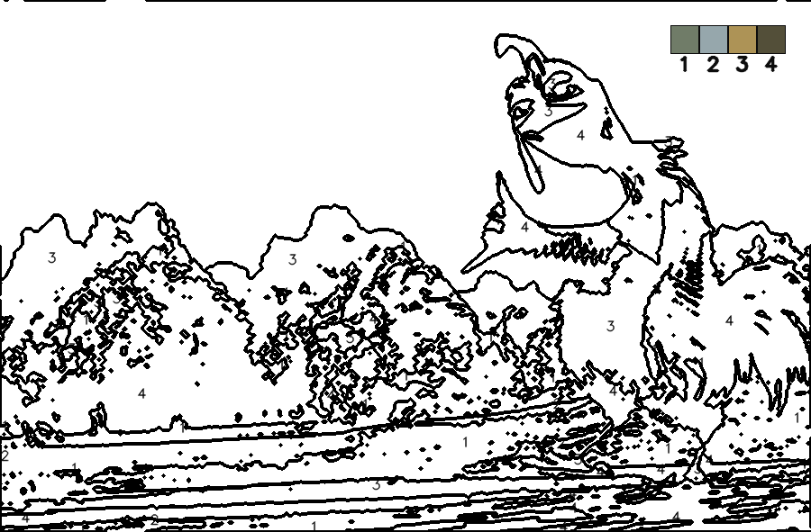
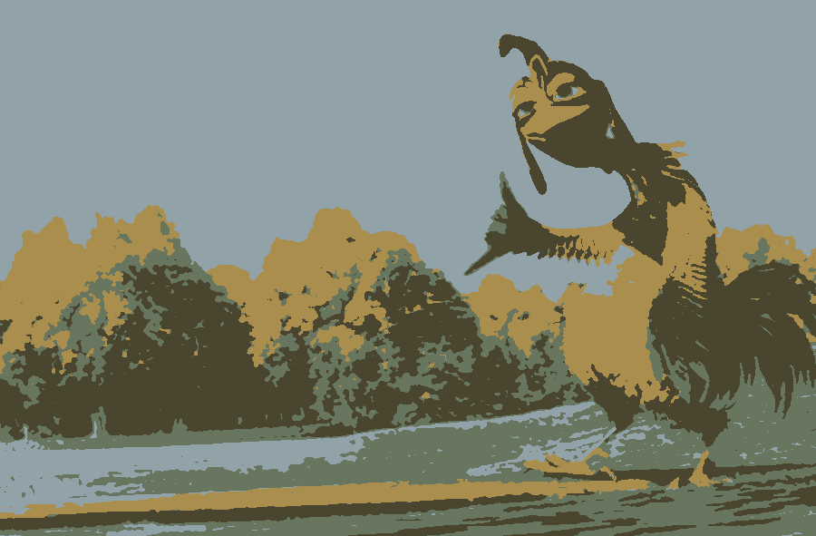

# Magic-Drawing

<div align="center">

<table>
   <tr>
      <th>Original input</th>
      <th>Worksheet (B/W with numbers)</th>
      <th>Colored result</th>
   </tr>
   <tr>
      <td></td>
      <td></td>
      <td></td>
   </tr>
   <tr>
      <td align="center"><em>chicken_joe.jpg</em></td>
      <td align="center"><em>outlined_chicken.png</em></td>
      <td align="center"><em>colored_chicken.png</em></td>
   </tr>
   </table>

</div>

Turn any picture into a French "Coloriage Magique" (paint-by-number) worksheet. The backend is FastAPI (Python), and the frontend is a tiny HTML/CSS/JS page to upload an image, set options, see the result, and download it.

This project is meant to be fun and educational.

You can check the code: it was kept simple and commented.

## What this project does

- You upload a picture (jpg/png/webp)
- The app simplifies the picture into a small set of colors (quantization)
- It generates clear black outlines and places numbers inside regions

## Tech stack

- Backend: Python, FastAPI, OpenCV, NumPy, Pillow
- Frontend: Vanilla HTML + CSS + small JS (no framework)

## Project structure

```
backend/
	main.py                # FastAPI app entry
	requirements.txt       # Python deps (FastAPI, OpenCV, NumPy, Pillow, ...)
	api/
		routes.py            # /health and /magic/convert
		schemas.py           # Request/response models
	ops/                   # Image operations
		io.py                # Decode/resize/encode helpers
		outline.py           # Canny edges
		quantize.py          # k-means color quantization
		segments.py          # label smoothing, merge small regions, CCs, label-based outlines
		placing.py           # number placement using distance transform
		render.py            # compose worksheet, draw numbers, labels visualization
	services/
		magic.py             # Orchestrates the full pipeline

frontend/
	index.html             # Minimal UI
	app.js                 # Call API, show images, download buttons
	style.css              # Styles

generate.ps1             # PowerShell: save PNGs from a JSON response
```

## Install (Windows)

Requirements: Python 3.10+ recommended.

```
python -m venv .venv
.\.venv\Scripts\activate
pip install -r backend\requirements.txt
```

Start the API server:

```
uvicorn backend.main:app --reload
```

Open the frontend:

- Easiest: double-click `frontend/index.html`
- Or live server at: http://127.0.0.1:5500

Swagger docs (API testing): http://127.0.0.1:8000/docs

## Use it

1. Open the frontend page
2. Choose an image file
3. Set parameters (hover the ℹ icon in the form to read tips)
4. Click "Generate".

You will see:

- Worksheet (with numbers) + Download button
- Preview image (if requested) + Download button
- Labels image (if requested) + Download button

Optional: save PNGs from a JSON response (PowerShell)

```
powershell -NoProfile -ExecutionPolicy Bypass -File .\generate.ps1 -JsonPath "C:\\path\\to\\response.json"
```

## If I had to explain the picture generation (detailed)

Below is the full pipeline. It is designed to produce those kid-friendly worksheets that are still faithful to the original picture.

1. Decode and EXIF orientation

   - We read the image bytes with Pillow, fix orientation from EXIF, convert to RGB
   - Then to NumPy BGR (OpenCV format)

2. Downscale (max_size)

   - Keep aspect ratio; set the largest side to `max_size`
   - Smaller size is faster and produces bigger regions (good for coloring)

3. Color quantization (k-means)

   - Cluster all pixels into `colors` groups (2..24)
   - Output:
     - `quant_bgr`: quantized color image
     - `label_map`: for each pixel, the cluster index (0..K-1)
     - `palette`: K colors (BGR)

4. Clean the label map

   - Median smoothing (3x3): removes salt-and-pepper noise
   - Merge micro regions: any connected component with area < `merge_area` is reassigned to the dominant neighbor label (3x3 neighborhood mode)

5. Outlines (two flavors)

   - `labels` outlines: compute boundaries where the label changes between neighbor pixels; dilate with `thickness` → always closed shapes
   - `canny` outlines: Canny edges from the grayscale photo; dilate with `thickness`
   - `outline_mode`:
     - `labels`: use only label boundaries (clean, closed regions)
     - `union`: bitwise OR of labels and canny (more details but still closed thanks to labels)

6. Regions and numbers

   - For each label, we find connected components (8-connectivity)
   - Filter by `min_area` so we avoid numbering tiny regions
   - Placement: distance transform picks a safe point inside the region (center of the fattest area)
   - Draw the number (we display `label + 1`)

7. Worksheet rendering

   - Start from a white canvas, draw black outlines, then draw numbers
   - Encode the result as PNG (base64) for easy viewing/downloading in the browser

8. Optional previews
   - `preview_png`: the quantized image
   - `labels_png`: a color visualization of the label map (for debugging/tuning)

### Tuning guide

- Fewer tiny areas: increase `merge_area`, decrease `colors`, increase `thickness`
- More details: decrease `merge_area`, increase `colors`, set `outline_mode=union`
- Too many numbers: increase `min_area`
- Broken lines: set `outline_mode=labels` and/or increase `thickness`
- Faster processing: reduce `max_size`

### Example settings

- Easy worksheet (young kids): `colors=4`, `max_size=900`, `thickness=3`, `min_area=120`, `merge_area=300`, `outline_mode=labels`
- Medium: `colors=8`, `max_size=1024`, `thickness=2`, `min_area=80`, `merge_area=200`, `outline_mode=union`
- Detailed: `colors=12`, `max_size=1400`, `thickness=2`, `min_area=60`, `merge_area=120`, `outline_mode=union`

## Thanks

Thanks to Matéo and LEMH!!
